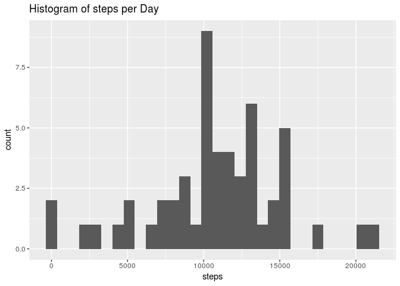
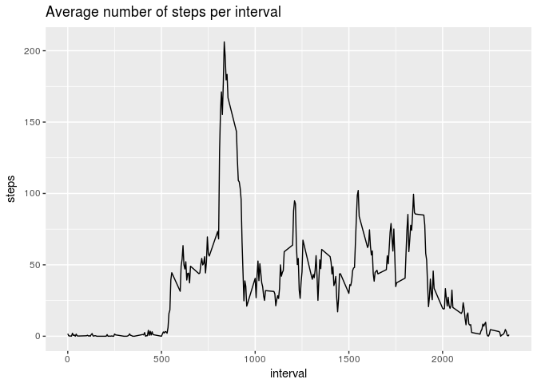
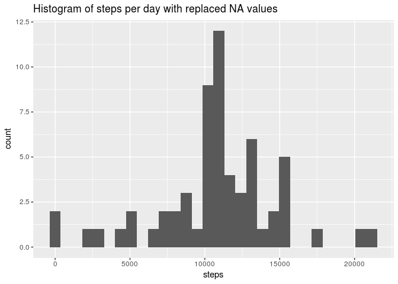
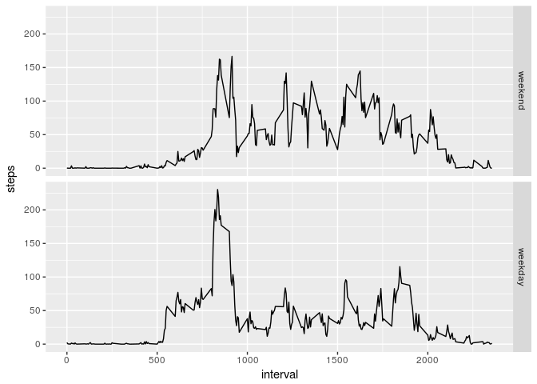

# Reproducible Research: Peer Assessment 1


## Loading and preprocessing the data

Unzip the activities if necessary. Read the data into the variable `activity`.

```r
if (!file.exists("activity.csv")) {
  unzip("activity.zip")  
}
activity <- read.csv("activity.csv")
```

We need to make date objects from the data in the date column. This will make further computations easier.

```r
suppressMessages(library(dplyr))
activity <- mutate(activity, date=as.Date(date, "%Y-%m-%d"))
```


## What is mean total number of steps taken per day?
Calculate the steps per day via `aggregate` functions and plot a historgram using `ggplot2`

```r
stepsPerDay <- aggregate(steps ~ date, activity ,sum)
library(ggplot2)
ggplot(stepsPerDay, aes(steps)) + geom_histogram(bins = 30) + ggtitle("Histogram of steps per Day")
```

<!-- -->

Calculating the mean and median of steps per day can be achieved with the `mean` and `median` function.

```r
options(scipen = 5)
meanSteps <- mean(stepsPerDay$steps)
medianSteps <- median(stepsPerDay$steps)
```

The mean total number of steps taken per day is 10766.1886792.

The median total number of steps taken per day is 10765.

## What is the average daily activity pattern?

Calculate the average steps per interval and plot them via `ggplot2`.

```r
stepsPerInterval <- aggregate(steps ~ interval, activity, mean)
ggplot(stepsPerInterval, aes(interval,steps)) + geom_line() + ggtitle("Average number of steps per interval")
```

<!-- -->

We calculate the maximum using `which.max`

```r
intervalIdx <- which.max(stepsPerInterval$steps)
interval <- stepsPerInterval[intervalIdx,"interval"]
```

The interval with maximum number of steps on average is 835.

## Imputing missing values

We calculate the number of missing values for the steps column:

```r
noOfNAs <- sum(is.na(activity$steps))
```

There are 2304 missing values.

### Strategy and new data set
We want to get rid of the missing values. That's why we are using the mean values per interval to fill in for the rows with missing steps value.

```r
meanStepsPerDay <- aggregate(steps ~ date, activity, mean)
activityNoNA <- activity
for (noRow in 1:nrow(activityNoNA)) {
  stepsRow <- activityNoNA[noRow,"steps"]
  if (is.na(stepsRow)) {
    intervalRow <- activityNoNA[noRow,"interval"]
    activityNoNA[noRow,"steps"] <- stepsPerInterval[stepsPerInterval$interval==intervalRow,"steps"]
  }
}
```

Calculate the steps per day for the new data set via `aggregate` functions and plot a historgram using `ggplot2`

```r
stepsPerDayNoNA <- aggregate(steps ~ date, activityNoNA, sum)
ggplot(stepsPerDayNoNA, aes(steps)) + geom_histogram(bins = 30) + ggtitle("Histogram of steps per day with replaced NA values")
```

<!-- -->

Calculating the mean and median of steps per day with replaced NA values can be achieved with the `mean` and `median` function.

```r
options(scipen = 5)
meanStepsNoNA <- mean(stepsPerDayNoNA$steps)
medianStepsNoNA <- median(stepsPerDayNoNA$steps)
```

The mean total number of steps taken per day is 10766.1886792.

The median total number of steps taken per day is 10766.1886792.

### Results

As you can see the histogram of the dataset with NAs and the one without NAs hardly differs. Also, the mean is the same. The median has become the mean which is an logical impact of our substitution of the NAs by the mean values.

## Are there differences in activity patterns between weekdays and weekends?

We calculate type of day for each row and then plot depending on type of day:

```r
activityNoNA <- mutate(activityNoNA, typeOfDay = ifelse(as.POSIXlt(activityNoNA$date)$wday %% 6 == 0, "weekend", "weekday"))
activityNoNA$typeOfDay <- factor(activityNoNA$typeOfDay, c("weekend", "weekday"))
stepsPerIntervalAndType <- aggregate(steps ~ interval + typeOfDay, activityNoNA, mean)
ggplot(stepsPerIntervalAndType, aes(interval,steps)) + geom_line() + facet_grid(typeOfDay ~ .)
```

<!-- -->

